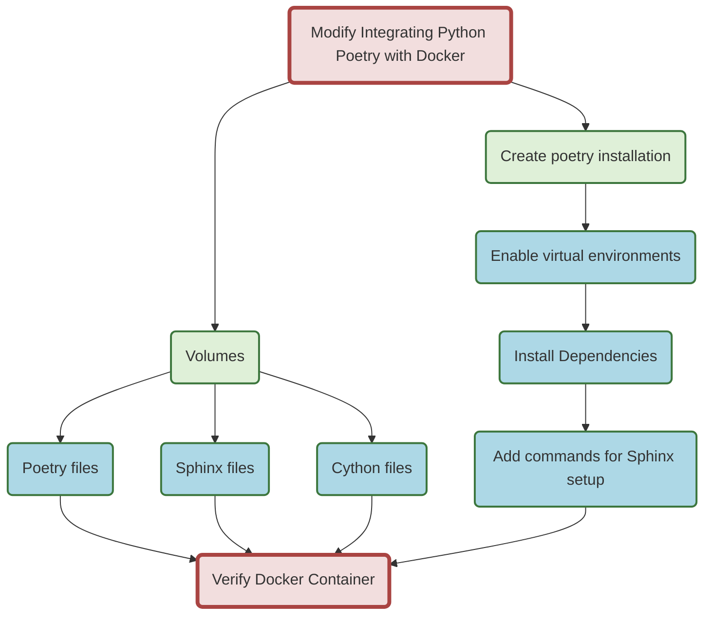

# Chapter 1

Testing!

```mermaid
graph TB

modifyPoetry(Modify Integrating Python Poetry with Docker)
enableEnv(Enable virtual environments)
createPoetry(Create poetry installation)
addSphinx(Add commands for Sphinx setup)
searchVolumes(Volumes)
createPoetryVolumes(Poetry files)
createSphinxVolumes(Sphinx files)
createCythonVolumes(Cython files)
verifyContainer(Verify Docker Container)
installDependency(Install Dependencies)

modifyPoetry --> createPoetry
createPoetry --> enableEnv
enableEnv --> installDependency
installDependency --> addSphinx
modifyPoetry --> searchVolumes
searchVolumes --> createPoetryVolumes
searchVolumes --> createSphinxVolumes
searchVolumes --> createCythonVolumes
createPoetryVolumes --> verifyContainer
createSphinxVolumes --> verifyContainer
createCythonVolumes --> verifyContainer
addSphinx --> verifyContainer

style modifyPoetry fill:#F2DEDE,stroke:#A94442,stroke-width:4px
style verifyContainer fill:#F2DEDE,stroke:#A94442,stroke-width:4px
style createPoetry fill:#DFF0D8,stroke:#3C763D,stroke-width:2px 
style searchVolumes fill:#DFF0D8,stroke:#3C763D,stroke-width:2px
style createCythonVolumes fill:#DFF0D8,stroke:#3C763D,stroke-width:2px
style enableEnv fill:#ADD8E6,stroke:#3C763D,stroke-width:2px
style installDependency fill:#ADD8E6,stroke:#3C763D,stroke-width:2px
style addSphinx fill:#ADD8E6,stroke:#3C763D,stroke-width:2px
style createPoetryVolumes fill:#ADD8E6,stroke:#3C763D,stroke-width:2px
style createSphinxVolumes fill:#ADD8E6,stroke:#3C763D,stroke-width:2px
style createCythonVolumes fill:#ADD8E6,stroke:#3C763D,stroke-width:2px
```
